Link for the forked repository - https://github.com/AnoukMartinez/lecture5-dockerk8s-demo

Docker Username - anoukmartinez0

# Lecture 5: Docker & Kubernetes Demo

> DevOps for Cyber-Physical Systems | University of Bern

A Task Manager app demonstrating Docker containerization and Kubernetes orchestration.

## Architecture

**Docker Compose:**
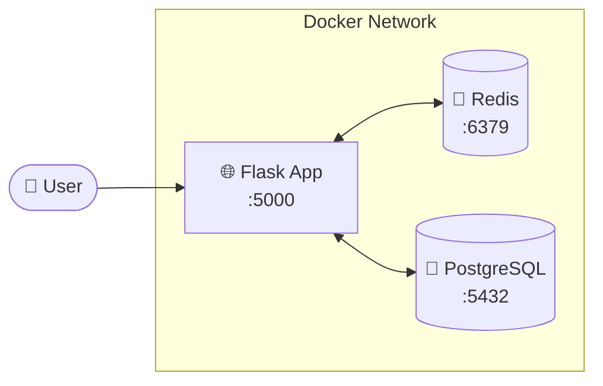

**Kubernetes:**
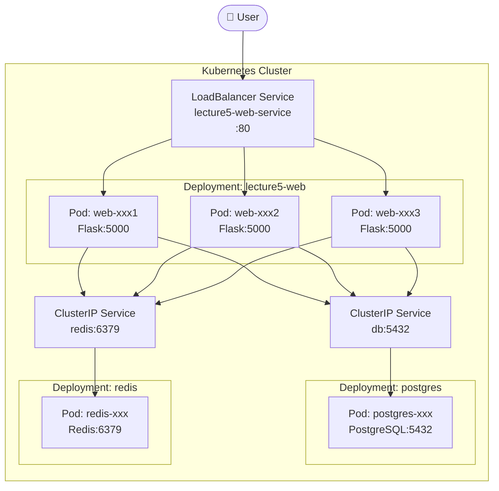

## Project Structure

```
lecture5-docker-demo/
├── app.py              # Flask application
├── Dockerfile          # Build instructions
├── docker-compose.yml  # Multi-service setup
├── k8s-backend.yaml    # K8s: PostgreSQL + Redis
├── k8s-web.yaml        # K8s: Web app deployment
├── test_load_balancing.py  # Load balancing test
├── templates/
│   └── index.html      # Web UI
└── assets/             # Logo images
```

---

# Part 1: Docker 🐳

## Quick Start with Docker Compose

```bash
# Start all services
docker compose up

# Open http://localhost:5000

# Stop
docker compose down
```

## Docker Commands Reference

| Command | Description |
|---------|-------------|
| `docker compose up` | Start all services |
| `docker compose down` | Stop all services |
| `docker compose down -v` | Stop + delete data |
| `docker compose logs -f` | View logs |
| `docker compose exec db psql -U taskuser -d taskdb` | Access database |
| `docker compose exec redis redis-cli` | Access Redis |

## Building Your Own Docker Image

**Option 1: Build yourself**
```bash
docker build -t YOUR-USERNAME/lecture5-webapp:v1.0 .
docker push YOUR-USERNAME/lecture5-webapp:v1.0
```

**Option 2: Use pre-built image**
```bash
# Use merabro/lecture5-webapp:v1.1 in your deployments
# Already built and available on Docker Hub
```

---

# Part 2: Kubernetes ☸️

## Prerequisites

Install Minikube for local Kubernetes:
- **Windows/Mac**: Enable Kubernetes in Docker Desktop Settings
- **All platforms**: Install Minikube from https://minikube.sigs.k8s.io/

## Step 1: Start Minikube

```bash
minikube start
```

<details>
<summary>Expected Output</summary>

```
😄  minikube v1.37.0 on Microsoft Windows 11
✨  Automatically selected the docker driver
👍  Starting "minikube" primary control-plane node in "minikube" cluster
🔥  Creating docker container (CPUs=2, Memory=7900MB) ...
🐳  Preparing Kubernetes v1.34.0 on Docker 28.4.0 ...
🔗  Configuring bridge CNI (Container Networking Interface) ...
🔎  Verifying Kubernetes components...
🌟  Enabled addons: storage-provisioner, default-storageclass
🏄  Done! kubectl is now configured to use "minikube" cluster
```
</details>

## Step 2: Build and Push Docker Image

```bash
# Build the image
docker build -t merabro/lecture5-webapp:v1.1 .

# Login to Docker Hub
docker login

# Push to Docker Hub
docker push merabro/lecture5-webapp:v1.1
```

<details>
<summary>Expected Output</summary>

```
[+] Building 9.2s (13/13) FINISHED
 => [1/7] FROM docker.io/library/python:3.11-slim
 => [2/7] WORKDIR /app
 => [3/7] COPY requirements.txt .
 => [4/7] RUN pip install --no-cache-dir -r requirements.txt
 => [5/7] COPY app.py .
 => [6/7] COPY templates/ templates/
 => [7/7] COPY assets/ assets/
 => exporting to image

The push refers to repository [docker.io/merabro/lecture5-webapp]
v1.1: digest: sha256:a827246ae97bcc39ab8930e90935690d71aec1bb54a46d92751b478fdd647481
```
</details>

## Step 3: Deploy Backend Services (PostgreSQL + Redis)

```bash
kubectl apply -f k8s-backend.yaml
```

<details>
<summary>Expected Output</summary>

```
persistentvolumeclaim/postgres-pvc created
deployment.apps/postgres created
service/db created
deployment.apps/redis created
service/redis created
```
</details>

Check backend pods:
```bash
kubectl get pods
```

<details>
<summary>Expected Output</summary>

```
NAME                        READY   STATUS    RESTARTS   AGE
postgres-5695fbfd64-mlcqw   1/1     Running   0          14s
redis-57566c54f6-nzbtj      1/1     Running   0          14s
```
</details>

## Step 4: Deploy Web Application

```bash
kubectl apply -f k8s-web.yaml
```

<details>
<summary>Expected Output</summary>

```
deployment.apps/lecture5-web created
service/lecture5-web-service created
```
</details>

Check all resources:
```bash
kubectl get deployments
kubectl get services
kubectl get pods
```

<details>
<summary>Expected Output</summary>

```
NAME           READY   UP-TO-DATE   AVAILABLE   AGE
lecture5-web   3/3     3            3           67s
postgres       1/1     1            1           101s
redis          1/1     1            1           101s

NAME                   TYPE           CLUSTER-IP       PORT(S)        AGE
db                     ClusterIP      10.99.17.144     5432/TCP       104s
kubernetes             ClusterIP      10.96.0.1        443/TCP        5m5s
lecture5-web-service   LoadBalancer   10.107.153.104   80:30262/TCP   70s
redis                  ClusterIP      10.99.151.191    6379/TCP       104s

NAME                           READY   STATUS    RESTARTS   AGE
lecture5-web-5c5d44c79-7zb57   1/1     Running   0          75s
lecture5-web-5c5d44c79-n4zx5   1/1     Running   0          75s
lecture5-web-5c5d44c79-qqqdx   1/1     Running   0          75s
postgres-5695fbfd64-mlcqw      1/1     Running   0          109s
redis-57566c54f6-nzbtj         1/1     Running   0          109s
```
</details>

## Step 5: Access the Application

```bash
minikube service lecture5-web-service
```

<details>
<summary>Expected Output</summary>

```
┌───────────┬──────────────────────┬─────────────┬────────────────────────┐
│ NAMESPACE │         NAME         │ TARGET PORT │          URL           │
├───────────┼──────────────────────┼─────────────┼────────────────────────┤
│ default   │ lecture5-web-service │             │ http://127.0.0.1:63501 │
└───────────┴──────────────────────┴─────────────┴────────────────────────┘
🏃  Starting tunnel for service lecture5-web-service.
🎉  Opening service default/lecture5-web-service in default browser...
```
</details>

The browser will automatically open to the app!

## Step 6: Demo - Scaling

Scale the web app from 3 to 5 replicas:

```bash
kubectl scale deployment lecture5-web --replicas=5
kubectl get pods
```

<details>
<summary>Expected Output</summary>

```
deployment.apps/lecture5-web scaled

NAME                           READY   STATUS    RESTARTS   AGE
lecture5-web-5c5d44c79-7zb57   1/1     Running   0          2m33s
lecture5-web-5c5d44c79-hjn25   1/1     Running   0          7s
lecture5-web-5c5d44c79-n4zx5   1/1     Running   0          2m33s
lecture5-web-5c5d44c79-qqqdx   1/1     Running   0          2m33s
lecture5-web-5c5d44c79-xtgp5   1/1     Running   0          7s
postgres-5695fbfd64-mlcqw      1/1     Running   0          3m7s
redis-57566c54f6-nzbtj         1/1     Running   0          3m7s
```
</details>

## Step 7: Demo - Rolling Update

Update the app to a new version:

```bash
kubectl set image deployment/lecture5-web web=merabro/lecture5-webapp:v1.1
kubectl rollout status deployment/lecture5-web
```

<details>
<summary>Expected Output</summary>

```
deployment.apps/lecture5-web image updated
Waiting for deployment "lecture5-web" rollout to finish: 1 old replicas are pending termination...
Waiting for deployment "lecture5-web" rollout to finish: 1 old replicas are pending termination...
deployment "lecture5-web" successfully rolled out
```
</details>

## Step 8: Test Load Balancing

Run the load balancing test:

```bash
# Install requests library
pip install requests

# Run test
python test_load_balancing.py
```

<details>
<summary>Expected Output</summary>

```
🚀 Testing load balancing across pods...
📍 Service URL: http://127.0.0.1:63501/info
🔄 Making 20 requests...

Request  1: Served by lecture5-web-dd74c46f6-c26t2
Request  2: Served by lecture5-web-dd74c46f6-jk2jm
Request  3: Served by lecture5-web-dd74c46f6-jk2jm
...
Request 20: Served by lecture5-web-dd74c46f6-jk2jm

============================================================
📊 LOAD BALANCING RESULTS
============================================================

Total successful requests: 20
Number of unique pods serving requests: 5

lecture5-web-dd74c46f6-9vpgq:  5 requests ( 25.0%) █████
lecture5-web-dd74c46f6-c26t2:  4 requests ( 20.0%) ████
lecture5-web-dd74c46f6-jk2jm:  4 requests ( 20.0%) ████
lecture5-web-dd74c46f6-pv2tc:  4 requests ( 20.0%) ████
lecture5-web-dd74c46f6-pmgjm:  3 requests ( 15.0%) ███

============================================================
✅ SUCCESS: Load balancing is working!
   Traffic distributed across 5 pods
============================================================
```
</details>

## Kubernetes Dashboard (Optional)

View your cluster in a web UI:

```bash
minikube dashboard
```

This opens a visual dashboard showing all your deployments, pods, services, and resource usage.

## Useful kubectl Commands

| Command | Description |
|---------|-------------|
| `kubectl get pods` | List all pods |
| `kubectl get deployments` | List all deployments |
| `kubectl get services` | List all services |
| `kubectl logs POD_NAME` | View pod logs |
| `kubectl describe pod POD_NAME` | Detailed pod info |
| `kubectl exec -it POD_NAME -- /bin/bash` | Shell into pod |
| `kubectl delete pod POD_NAME` | Delete pod (auto-recreates) |
| `kubectl scale deployment NAME --replicas=N` | Scale deployment |

## Cleanup

```bash
# Delete everything
kubectl delete -f k8s-web.yaml
kubectl delete -f k8s-backend.yaml

# Stop Minikube
minikube stop

# Delete Minikube cluster
minikube delete
```

---

## How It Works

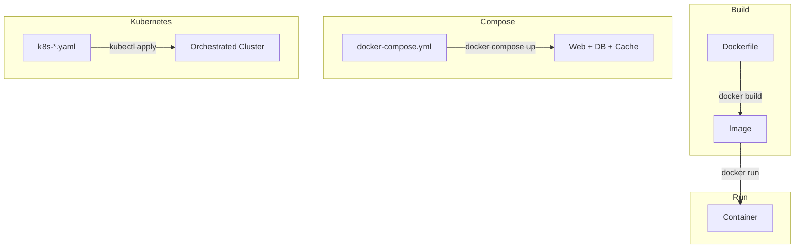

**Dockerfile** → Recipe to build an image  
**Image** → Snapshot of your app + dependencies  
**Container** → Running instance of an image  
**Compose** → Run multiple containers together  
**Kubernetes** → Orchestrate containers at scale with auto-scaling, self-healing, load balancing

---

**University of Bern | DevOps for Cyber-Physical Systems**

---

# Task Documentation

## Task 1: Modify the Docker Setup
### a) Adding Adminer
For this task, I added the adminer settings to the `docker-compose.yml` file. I created a new small section titled "Database UI" directly under the Database section, since they are somewhat related, and added all the required settings (image, depends_on, network). I also added the restart always since it's included in the adminer example setup, and it seemed like a good idea to include it to avoid any future issues. I also added the adminer default server variable on top under the other environment variables.

Running this caused no issues and worked right away.
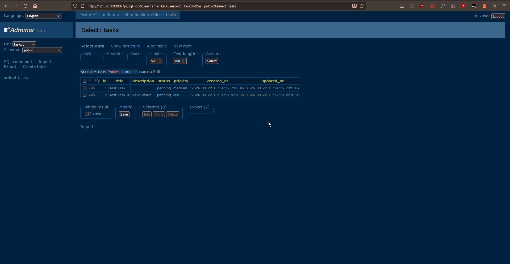

### b) Changing Base Image / Rebuilding
To change the python version, I changed line 12 in the dockerfile:

```
FROM python:3.11-slim # from this...
FROM python:3.11-alpine # ...to this
```

Using `docker compose down` and then `docker compose up` again revealed no change in size for the built repository, so I assumed it just restarted the services without actually touching the python version specified in the docker file. So once again I shut down all services, and then ran `docker compose build --no-cache` command (https://stackoverflow.com/questions/35594987/how-to-force-docker-for-a-clean-build-of-an-image#comment78722162_35595021). This showed a significant change in file size:

- Using python slim: lecture5-dockerk8s-demo-web - 232MB
- Using python alpine: lecture5-dockerk8s-demo-web - 127MB

## Task 2: Docker Operations
### a) Image Tagging and Registry
For this task, I followed the instructions from the assignment 1:1 at first. Using the command `docker build -t task-app:v1.0 .`, I built a local image of the task app. I then signed in with my Docker Account on the Hub. However, when trying to follow a guide on how to push the image, I realized that usually a username is required in the image to link it to the Docker Hub account (https://docs.docker.com/get-started/docker-concepts/building-images/build-tag-and-publish-an-image/). Attempting to use docker push without this (Even after using docker login) on the console resulted in the following error: `failed to authorize: failed to fetch oauth token: Post "https://auth.docker.io/token": context canceled`.
So I rebuilt the image using the following command, as well as the docker push command afterwards to push the image onto the Docker Hub.
- `docker build -t anoukmartinez0/task-app:v1.0 .`
- `docker push anoukmartinez0/task-app:v1.0 `

This worked (https://hub.docker.com/repository/docker/anoukmartinez0/task-app/general).
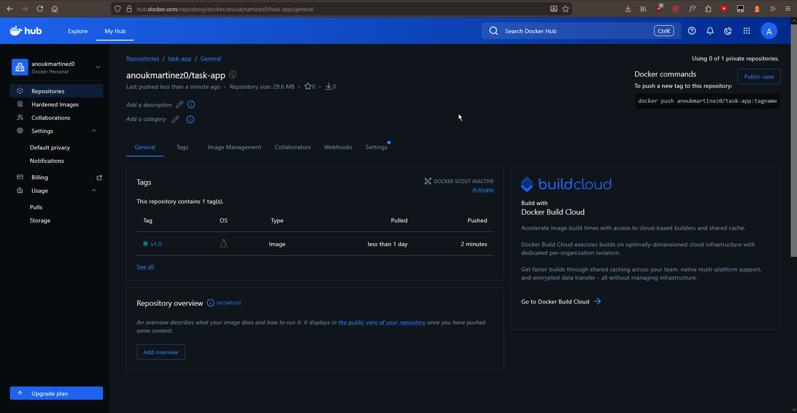

### b) Container Inspection
Running the given commands resulted in the following outputs.
- `docker compose logs web`
    ```
    lecture5-web  | Database initialized successfully!
    lecture5-web  |  * Serving Flask app 'app'
    lecture5-web  |  * Debug mode: on
    lecture5-web  | WARNING: This is a development server. Do not use it in a production deployment. Use a production WSGI server instead.
    lecture5-web  |  * Running on all addresses (0.0.0.0)
    lecture5-web  |  * Running on http://127.0.0.1:5000
    lecture5-web  |  * Running on http://172.19.0.5:5000
    lecture5-web  | Press CTRL+C to quit
    lecture5-web  |  * Restarting with stat
    lecture5-web  |  * Debugger is active!
    lecture5-web  |  * Debugger PIN: 110-254-778
    ```

    This seems to display all the log outputs from the application itself (Independent of docker). Above we can see the typical output for running a Flask server in development mode.

- `docker inspect lecture5-web` (I shortened this one since it was quite long)
    ```
    PS C:\Users\loveo\Documents\UNIFR\DevOp\lecture5-dockerk8s-demo> docker inspect lecture5-web
    [
        {
            "Id": "d03063f94e178da33e33a2faa6932294a10f17ef0d224e4e23fd0ac066f5e536",
            "Created": "2026-03-22T14:19:11.344835716Z",
            "Path": "python",
            "Args": [
                "app.py"
            ],
            "State": {
                "Status": "running",
                "Running": true,
                ...
            },
            "Image": "sha256:6209cc13cdb2a6e2da9674ccfeedb84d67d5b2bd3a4bf324eac293d089ed53b9",
            ...
            "Name": "/lecture5-web",
            "RestartCount": 0,
            "Driver": "overlayfs",
            "Platform": "linux",
            "MountLabel": "",
            "ProcessLabel": "",
            "AppArmorProfile": "",
            "ExecIDs": null,
            "HostConfig": {
                ...
            "GraphDriver": {
                ...
            },
            "Mounts": [
                {
                    "Type": "bind",
                    "Source": "C:\\Users\\loveo\\Documents\\UNIFR\\DevOp\\lecture5-dockerk8s-demo\\app.py",
                    "Destination": "/app/app.py",
                    "Mode": "ro",
                    "RW": false,
                    "Propagation": "rprivate"
                },
                ...
            ],
            "Config": {
                "Hostname": "d03063f94e17",
                "Domainname": "",
                ...
            },
            "NetworkSettings": {
                "Bridge": "",
                "SandboxID": "b61c4fc34bce53173afb23121d3cd74f2ec1a2217d907c25097a3cd23b6c4fc9",
                "SandboxKey": "/var/run/docker/netns/b61c4fc34bce",
                "Ports": {
                    "5000/tcp": [
                        {
                            "HostIp": "0.0.0.0",
                            "HostPort": "5000"
                        },
                        {
                            "HostIp": "::",
                            "HostPort": "5000"
                        }
                    ]
                },
                ...
        }
    ]
    ```
    This seems to be giving a detailed overview over the application/containers running, such as information about the machine running the services, the image, network settings and more.
- `docker stats`
    ```
    CONTAINER ID   NAME                                CPU %     MEM USAGE / LIMIT     MEM %     NET I/O           BLOCK I/O        PIDS
    5844d985dc2a   lecture5-dockerk8s-demo-adminer-1   0.00%     8.344MiB / 7.718GiB   0.11%     1.04kB / 126B     2.25MB / 0B      1
    d03063f94e17   lecture5-web                        0.17%     56.66MiB / 7.718GiB   0.72%     3.96kB / 3.45kB   11.7MB / 311kB   3
    d3086f98b786   lecture5-db                         0.00%     21.46MiB / 7.718GiB   0.27%     5.36kB / 3.09kB   38MB / 610kB     6
    e09f1525daac   lecture5-redis                      0.34%     4.961MiB / 7.718GiB   0.06%     2.12kB / 126B     18.6MB / 0B      6
    ```
    This seems to append a small output in the console that updates live every second, giving information about how much CPU/memory usage each service consumes on the machine running. We can see for instance the consumption for the web service, database and redis seperately above.

## Task 3: Deploy to Kubernetes
### a) Deploying the application
For this, I installed minikube and ran `minikube start`. At first this failed because minikube attempted to use my VirtualBox Driver for some reason. I fixed this by starting over and running `minikube start --driver=docker`. This worked with no issue.

Rebuilding the webapp and replacing the username in `k8s-web.yaml` was also no issue (https://hub.docker.com/repository/docker/anoukmartinez0/lecture5-webapp/general). I had to push the image twice here since I forgot to replace the username at first.

Accessing the webapp after this was also no problem.
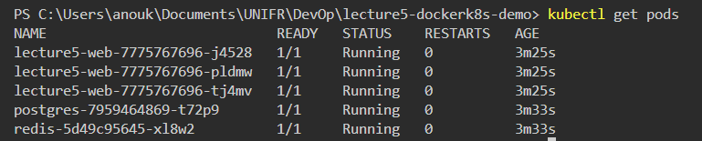
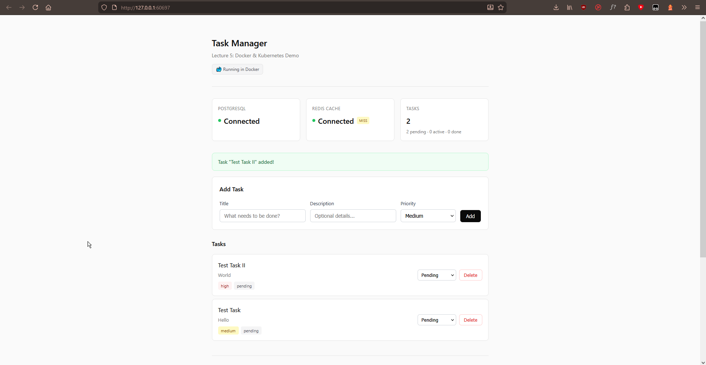

### b) Scale and Test Load Balancing
One small thing I had to change for this to work is using a double dash for the replicas flag and seperating the deployment from the appname via a slash. I found this out via the Kubernetes documentation in the section "Scaling a Deployment" (https://kubernetes.io/docs/concepts/workloads/controllers/deployment/).
The correct command looks as follows:
```
PS C:\Users\loveo\Documents\UNIFR\DevOp\lecture5-dockerk8s-demo> kubectl scale deployment lecture5-web --replicas=5       
deployment.apps/lecture5-web scaled
```

The load balancing test script ran just fine, but for some reason it wasn't able to establish a connection with the webapp. 
```
PS C:\Users\loveo\Documents\UNIFR\DevOp\lecture5-dockerk8s-demo> python test_load_balancing.py
🚀 Testing load balancing across pods...
📍 Service URL: http://127.0.0.1:63501/info
🔄 Making 20 requests...

Request  1: Failed - HTTPConnectionPool(host='127.0.0.1', port=63501): Max retries exceeded with url: /info (Caused by NewConnectionError('<urllib3.connection.HTTPConnection object at 0x000002428B8341A0>: Failed to establish a new connection: [WinError 10061] Es konnte keine Verbindung hergestellt werden, da der Zielcomputer die Verbindung verweigerte'))
```

Using `kubectl get service lecture5-web-service`, I noticed that the service seemingly runs on another port than expected from the python script.
```
NAME                   TYPE           CLUSTER-IP     EXTERNAL-IP   PORT(S)        AGE
lecture5-web-service   LoadBalancer   10.103.95.21   127.0.0.1     80:30205/TCP   38m
```

Upon further inspection, I found that the port for the load balancing is specified to 80 in the ``k8s-web.yaml` file. So I changed the port in the script to 80 for now. This resulted in the script working as intended, but for some reason all the requests were still handled by the same node.
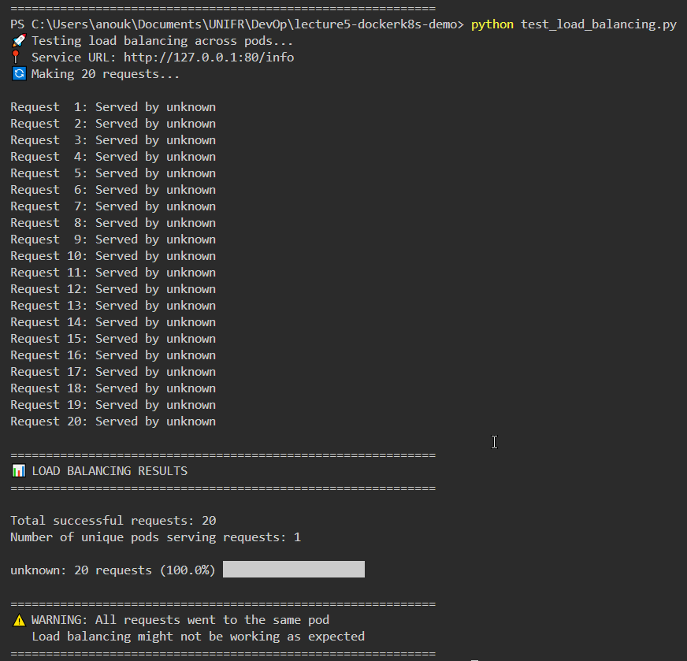

Upon further inspection, I noticed that in the script, it assumes that the response from our webapp includes a field "pod_name", but when accessing the /info route, this doesn't seem to be included in the response. I checked the app.py and saw that the pod_name should theoretically be included in the response, but that's not the case in practice.

```
@app.route('/info')
def info():
    """Show environment info - demonstrates Docker env vars"""
    return jsonify({
        'app': 'DevOps Lecture 5 Demo',
        'version': '1.0.0',
        'pod_name': socket.gethostname(), <-- here fills it
        'environment': {
            'DB_HOST': DB_HOST,
            'DB_PORT': DB_PORT,
            'DB_NAME': DB_NAME,
            'REDIS_HOST': REDIS_HOST,
            'REDIS_PORT': REDIS_PORT
        },
        'message': 'Configuration from environment variables!'
    })
```
```
    pod_name = data.get('pod_name', 'unknown') <-- tries accessing or put unknown (the case for me)
    pod_responses.append(pod_name)
```
```
{
  "app": "DevOps Lecture 5 Demo",
  "environment": {
    "DB_HOST": "db",
    "DB_NAME": "taskdb",
    "DB_PORT": "5432",
    "REDIS_HOST": "redis",
    "REDIS_PORT": 6379
  },
  "message": "Configuration from environment variables!",
  "version": "1.0.0"
}

...Missing the pod field?
```

I decided to just quit all the minikube services/pods and rebuild the image at this point. Here's all the commands I ran for this:
```
kubectl delete -f k8s-web.yaml
kubectl delete -f k8s-backend.yaml
minikube stop
minikube delete
```
I then reran the instructions from the worksheet.
This time around, the script worked fine apart from one little change, being that I had to run `minikube tunnel` (https://minikube.sigs.k8s.io/docs/handbook/accessing/) in another terminal. Otherwise the same issue with the request being rejected occurs again.
This appears to be a necessary step anyway (See section LoadBalancer access/Example of a Load Balancer).

The Python script now runs fine and produces some better results compared to before!
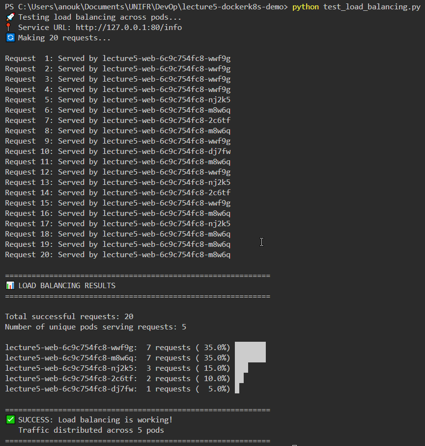

---

*So how does Kubernetes distribute traffic?*

Kubernetes distributes traffic through "kube-proxy" (https://kubernetes.io/docs/reference/command-line-tools-reference/kube-proxy/), which sets up iptables rules for each node. Per default this uses a random selection of nodes with the same probability, which in practice works somewhat like a round robin approach for a large number of requests. I am guessing since we only test 20 requests in the script, two of the nodes just got "lucky" by getting 7 requests each in the test run, while another only got 1 request by sheer luck. We can see this in practice as well by just rerunning the python script, which will result in a slightly different distribution of the requests handled each time.
```
lecture5-web-6c9c754fc8-wwf9g:  7 requests ( 35.0%) ███████
lecture5-web-6c9c754fc8-m8w6q:  7 requests ( 35.0%) ███████
lecture5-web-6c9c754fc8-nj2k5:  3 requests ( 15.0%) ███
lecture5-web-6c9c754fc8-2c6tf:  2 requests ( 10.0%) ██
lecture5-web-6c9c754fc8-dj7fw:  1 requests (  5.0%) █
```
```
lecture5-web-6c9c754fc8-nj2k5:  7 requests ( 35.0%) ███████
lecture5-web-6c9c754fc8-2c6tf:  4 requests ( 20.0%) ████
lecture5-web-6c9c754fc8-dj7fw:  3 requests ( 15.0%) ███
lecture5-web-6c9c754fc8-wwf9g:  3 requests ( 15.0%) ███
lecture5-web-6c9c754fc8-m8w6q:  3 requests ( 15.0%) ███
```

### c) Self Healing
Before
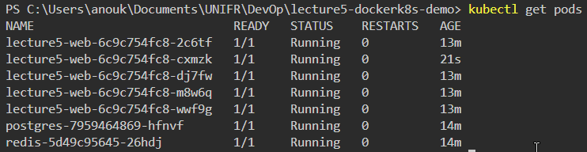
During
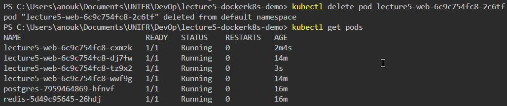
After
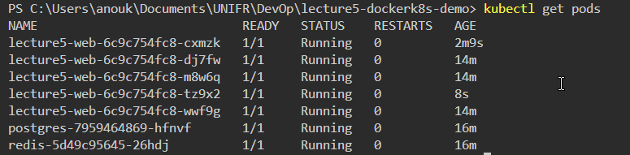

As we can see the missing pod gets replaced by another after a short delay.

---

*Why is self healing important?*

Self healing is important because we want our application to remain available even when individual pods fail, without requiring manual intervention. When one of our pods dies, Kubernetes should automatically come up with a replacement to maintain the expected number of replicas, so the load can still be evenly distributed. It should be as autonomous and self running as possible.
